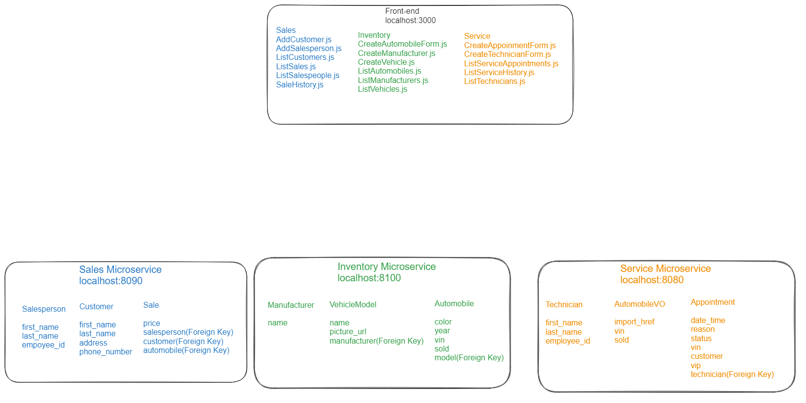

# __Testing markdown formatting__

# CarCar
CarCar is an car dealership application to manage your inventory, service, and sales needs. You can manage your inventory by adding manufacturers and the make and model of your cars. Track your sales through the automobiles list in inventory. The service feature allows you to add technicians and schedule service appointments. It also keeps a service history that you can search by VIN. If it is a returning customer that has purchased a vehicle they will be flagged as VIP. The Sales feature allows you to add customers and salespeople, and record new sales.

Team:
- Ken Yeh - Service Microservice
- Toran O'Brien - Sales Microservice

## Getting started
1. Fork this repository
2. Clone the forked repository to your local computer using: `git clone https://gitlab.com/toranaobrien/project-beta`
3. From the project directory run the following Docker commands:
```
    docker volume create beta-data
    docker compose build
    docker compose up
```

## Design
#### Inventory endpoints
Action                         | Method | URL
-------------------------------|--------|-------------------------------------------
List manufacturers             | GET    | http://localhost:8100/api/manufacturers/
Create a manufacturer          | POST   | http://localhost:8100/api/manufacturers/
Get a specific manufacturer    | GET    | http://localhost:8100/api/manufacturers/:id/
Update a specific manufacturer | PUT    | http://localhost:8100/api/manufacturers/:id/
Delete a specific manufacturer | DELETE | http://localhost:8100/api/manufacturers/:id/

Creating and updating a manufacturer requires only the manufacturer's name.
```
{
  "name": "Mazda"
}
```

The return value of creating, getting, and updating a single manufacturer is its name, href, and id.
```
{
  "href": "/api/manufacturers/1/",
  "id": 1,
  "name": "Mazda"
}
```

The list of manufacturers is a dictionary with the key "manufacturers" set to a list of manufacturers.
```
{
  "manufacturers": [
    {
      "href": "/api/manufacturers/1/",
      "id": 1,
      "name": "Mazda"
    }
  ]
}
```

#### Automobile endpoints
Action                       | Method | URL
--------------------------   |--------|-------------------------------------------
List automobiles             | GET    | http://localhost:8100/api/automobiles/
Create an automobile         | POST   | http://localhost:8100/api/automobiles/
Get a specific automobile    | GET    | http://localhost:8100/api/automobiles/:vin/
Update a specific automobile | PUT    | http://localhost:8100/api/automobiles/:vin/
Delete a specific automobile | DELETE | http://localhost:8100/api/automobiles/:vin/

Creating a vehicle model requires the model name, a URL of an image, and the id of the manufacturer.
```
{
  "name": "Mazda 3 Hatchback Turbo",
  "picture_url": "https://upload.wikimedia.org/wikipedia/commons/thumb/d/d9/Mazda_3_2.0_Fastback_Sport_2023_%288%29.jpg/640px-Mazda_3_2.0_Fastback_Sport_2023_%288%29.jpg",
  "manufacturer_id": 1
}
```

Updating a vehicle model can take the name and/or the picture URL. <mark>It is not possible to update a vehicle model's manufacturer.</mark>
```
{
  "name": "Mazda 3 Hatchback Turbo",
  "picture_url": "https://upload.wikimedia.org/wikipedia/commons/thumb/d/d9/Mazda_3_2.0_Fastback_Sport_2023_%288%29.jpg/640px-Mazda_3_2.0_Fastback_Sport_2023_%288%29.jpg"
}
```

Getting the detail of a vehicle model, or the return value from creating or updating a vehicle model, returns the model's information **and** the manufacturer's information.
```
{
  "href": "/api/models/1/",
  "id": 1,
  "name": "Mazda 3 Hatchback Turbo",
  "picture_url": "https://upload.wikimedia.org/wikipedia/commons/thumb/d/d9/Mazda_3_2.0_Fastback_Sport_2023_%288%29.jpg/640px-Mazda_3_2.0_Fastback_Sport_2023_%288%29.jpg",
  "manufacturer": {
    "href": "/api/manufacturers/1/",
    "id": 1,
    "name": "Mazda"
  }
}
```

Getting a list of vehicle models returns a list of the detail information with the key "models".
```
{
  "models": [
    {
      "href": "/api/models/1/",
      "id": 1,
      "name": "Mazda 3 Hatchback Turbo",
      "picture_url": "https://upload.wikimedia.org/wikipedia/commons/thumb/d/d9/Mazda_3_2.0_Fastback_Sport_2023_%288%29.jpg/640px-Mazda_3_2.0_Fastback_Sport_2023_%288%29.jpg",
      "manufacturer": {
        "href": "/api/manufacturers/1/",
        "id": 1,
        "name": "Mazda"
      }
    }
  ]
}
```

#### Service endpoints
Action                                    | Method | URL
------------------------------------------|--------|-------------------------------------------
List technicians                          | GET    | http://localhost:8080/api/technicians/
Create a technician                       | POST   | http://localhost:8080/api/technicians/
Delete a specific technician              | DELETE | http://localhost:8080/api/technicians/:id/
List appointments                         | GET    | http://localhost:8080/api/appointments/
Create an appointment                     | POST   | http://localhost:8080/api/appointments/
Delete an appointment                     | DELETE | http://localhost:8080/api/appointments/:id/
Set appointment status to "canceled"      | PUT    | http://localhost:8080/api/appointments/:id/cancel/
Set appointment status to "finished"      | PUT    | http://localhost:8080/api/appointments/:id/finish/

#### Sales endpoints
Action                                | Method | URL
--------------------------------------|--------|----------------------------------------
List salespeople                      | GET    | http://localhost:8090/api/salespeople/
Create a salesperson                  | POST   | http://localhost:8090/api/salespeople/
Delete a specific salesperson         | DELETE | http://localhost:8090/api/salespeople/:id/
List customers                        | GET    | http://localhost:8090/api/customers/
Create a customer                     | POST   | http://localhost:8090/api/customers/
Delete a specific customer            | DELETE | http://localhost:8090/api/customers/:id/
List sales                            | GET    | http://localhost:8090/api/sales/
Create a sale                         | POST   | http://localhost:8090/api/sales/
Delete a sale                         | DELETE | http://localhost:8090/api/sales/:id/

## Service microservice

The service microservice consists of three models: An Appointment model, a Technician model, and an AutomobileVO value object model containing vin and sold fields. Technician is a foreign key to the Appointment model.

## Sales microservice

Explain your models and integration with the inventory
microservice, here.

## Diagram


